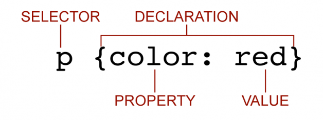
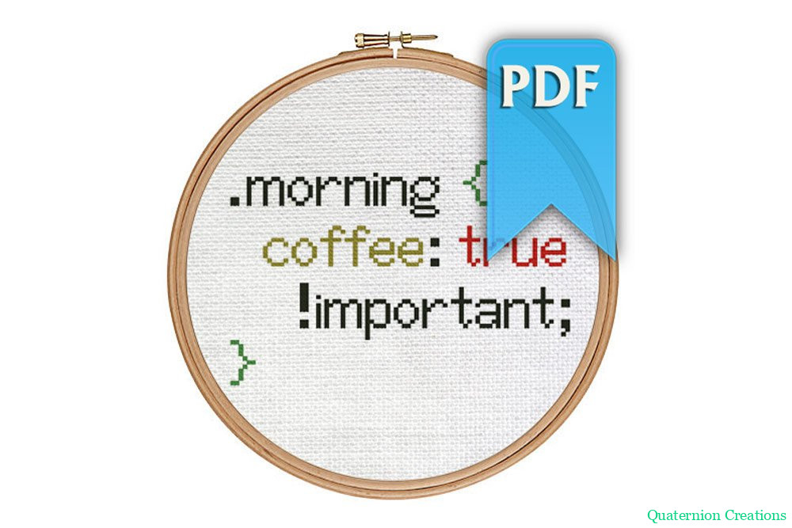

import {dark} from '@mdx-deck/themes'
import Duel from './components/Duel';
import SpecCalc from './components/SpecCalc';
import Spec from './components/Spec';
import {Image} from 'mdx-deck';
import SyntaxHighlighter from 'react-syntax-highlighter';
import { Split, Horizontal, SplitRight } from 'mdx-deck/layouts'
import styled from 'styled-components';
const customTheme = {
  Slide: {
    padding: '30px',
    fontSize: '30px',
  },
  code: {
    color: 'inherit',
  }
}
export const themes = [dark, customTheme];

# CSS Specificity
How Conflicting Styles Are Settled

---

## Anatomy of a CSS Rule


---

<Image size="50%" src="./assets/conflict.png"/>

---

# Test

---

<Duel
  ruleA={['.firebrick', 'color: firebrick;']}
  ruleB={['#chartreuse', 'color: chartreuse;']}
  stutter
  target={<div id="chartreuse" className="firebrick">Howdy!</div>}
  targetString='<div id="chartreuse" class="firebrick">Howdy!</div>'
/>

---

<Duel
  ruleA={['.firebrick', 'color: firebrick;']}
  ruleB={['#chartreuse', 'color: chartreuse;']}
  answer
  target={<div id="chartreuse" className="firebrick">Howdy!</div>}
  targetString='<div id="chartreuse" class="firebrick">Howdy!</div>'
/>

---

<Duel
  ruleA={['.peachpuff', 'background-color: peachpuff;']}
  ruleB={['div', 'background-color: tomato;']}
  stutter
  target={<div className="peachpuff">Howdy!</div>}
  targetString='<div class="peachpuff">Howdy!</div>'
/>

---

<Duel
  ruleA={['.peachpuff', 'background-color: peachpuff;']}
  ruleB={['div', 'background-color: tomato;']}
  answer
  target={<div className="peachpuff">Howdy!</div>}
  targetString='<div class="peachpuff">Howdy!</div>'
/>

---

Specificity is the means by which browsers decide which
CSS property values are the most relevant to an element
and, therefore, will be applied.

Source: [MDN](https://developer.mozilla.org/en-US/docs/Web/CSS/Specificity)

---

<SpecCalc />

---

# Exceptions to Specifity Calculations

---
# Inline Styles

  ```html
    <div style="color: tomato"></div>
  ```
  Is more specific than
  <Spec array={['∞','∞','∞']} />

---

# `!important`

  `!important` is more specific than inline styles

  There are very few good reasons to use this CSS rule.

  

---
<Duel
  ruleA={['.firebrick', 'color: firebrick;']}
  ruleB={['#chartreuse', 'color: chartreuse;']}
  stutter
  target={<div id="chartreuse" className="firebrick">Howdy!</div>}
  targetString='<div id="chartreuse" class="firebrick">Howdy!</div>'
/>

---

<Duel
  ruleA={['.firebrick', 'color: firebrick;']}
  ruleB={['#chartreuse', 'color: chartreuse;']}
  displaySpec
  answer
  target={<div id="chartreuse" className="firebrick">Howdy!</div>}
  targetString='<div id="chartreuse" class="firebrick">Howdy!</div>'
/>

---

<Duel
  ruleA={['.peachpuff', 'background-color: peachpuff;']}
  ruleB={['div', 'background-color: tomato;']}
  stutter
  target={<div className="peachpuff">Howdy!</div>}
  targetString='<div class="peachpuff">Howdy!</div>'
/>

---

<Duel
  ruleA={['.peachpuff', 'background-color: peachpuff;']}
  ruleB={['div', 'background-color: tomato;']}
  answer
  displaySpec
  target={<div className="peachpuff">Howdy!</div>}
  targetString='<div class="peachpuff">Howdy!</div>'
/>

---

<Duel
  ruleA={['div.huge.so-big.you-wont-believe', 'font-size: 200px;']}
  ruleB={['div#smoll', 'font-size: 5px;']}
  stutter
  target={<div className="huge so-big you-wont-believe" id="smoll">Howdy!</div>}
  targetString='<div class="huge so-big you-wont-believe" id="smoll">Howdy!</div>'
/>

---

<Duel
  ruleA={['div.huge.so-big.you-wont-believe', 'font-size: 200px;']}
  ruleB={['div#smoll', 'font-size: 5px;']}
  answer
  displaySpec
  target={<div className="huge so-big you-wont-believe" id="smoll">Howdy!</div>}
  targetString='<div class="huge so-big you-wont-believe" id="smoll">Howdy!</div>'
/>

---

# tl;dr
If a CSS rule is being overwritten when it shouldn't:

Throw in an `!important` and go home.

---

# JK

---

# Actual tl;dr

If a CSS rule is being overwritten when it shouldn't:

Calculate the selector's specificity and adjust before resorting to `!important`.

---

# Thanks
